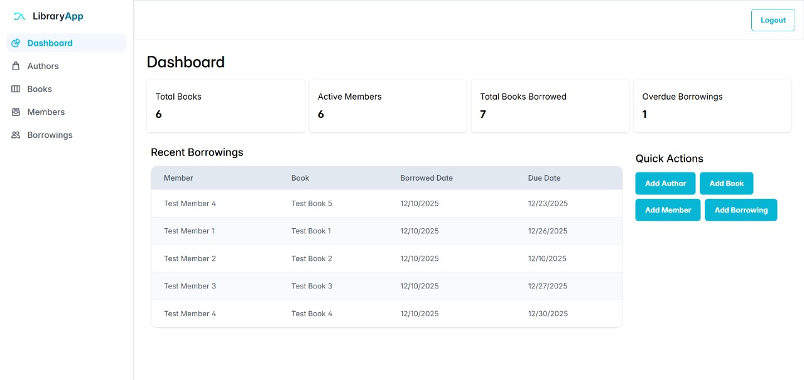
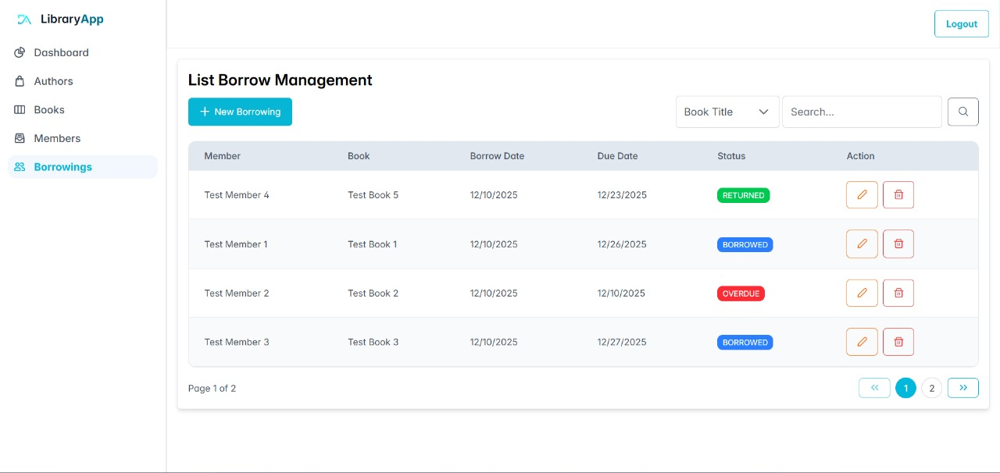
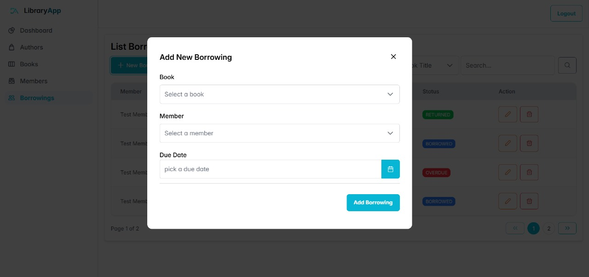
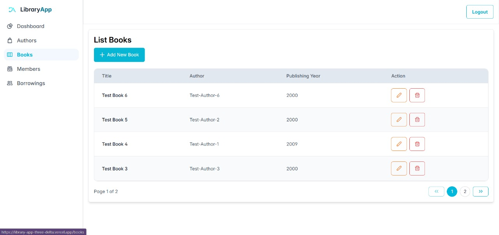
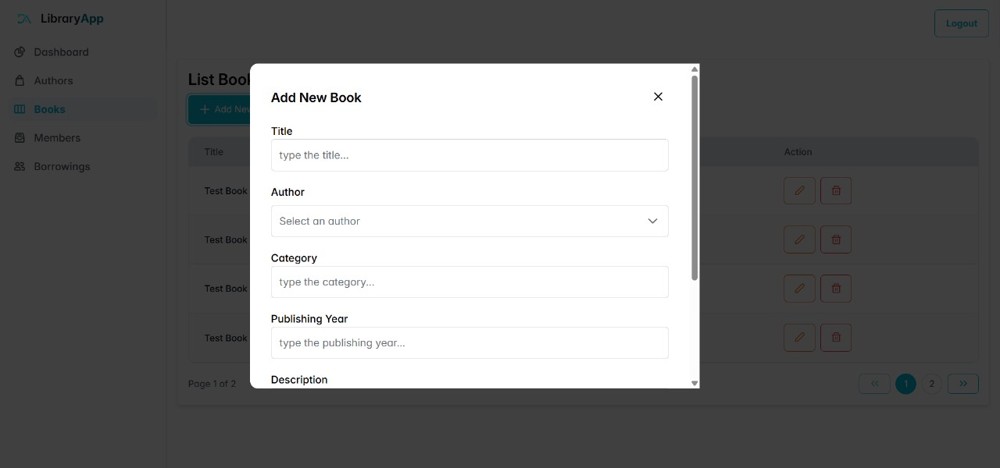
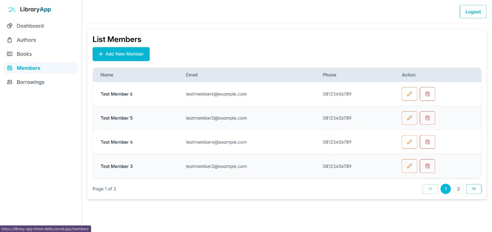
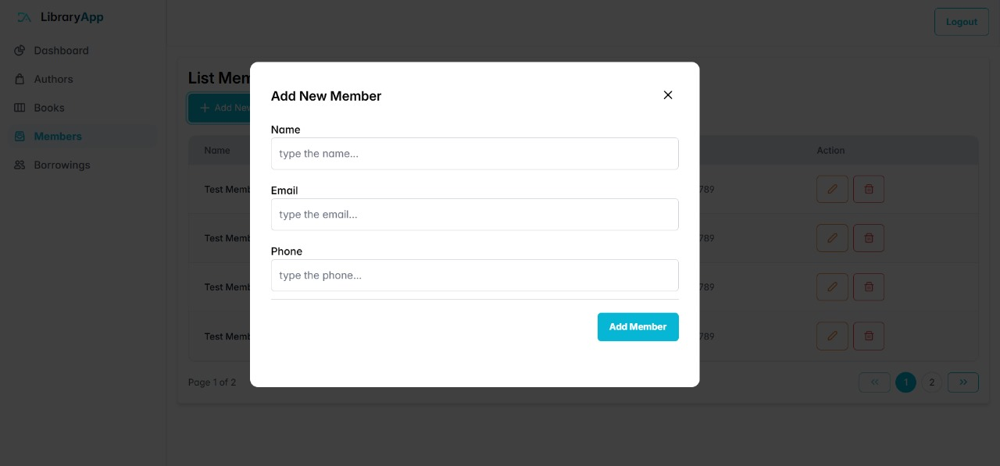
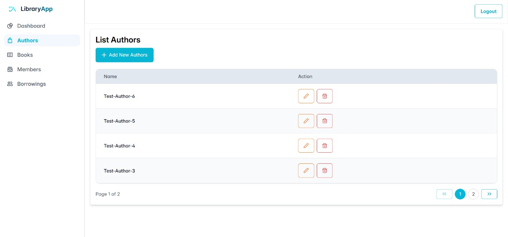
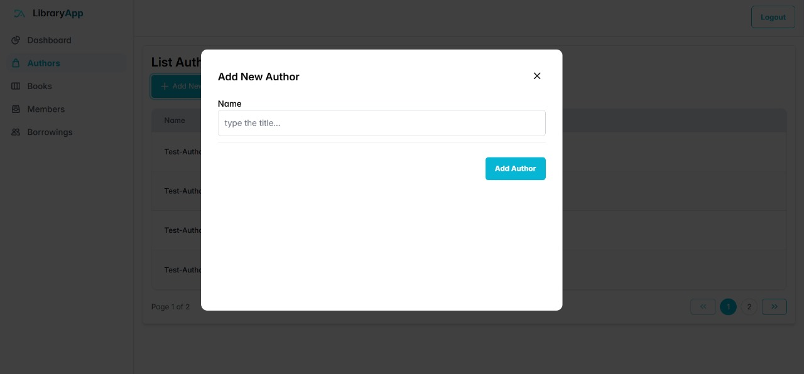

# 📚 Library Management System

A full-stack web application for managing library operations including managing books, authors, members, and borrowings.  
This system includes authentication, dashboard analytics, and full CRUD modules with modern UI.

---

## 🚀 Live Demo

| Service        | URL                                         |
| -------------- | ------------------------------------------- |
| 🌐 Frontend    | https://library-app-three-delta.vercel.app/ |
| 🛠️ Backend API | https://server-dark-glitter-4675.fly.dev/   |

> Default login:  
> **Email:** admin@example.com  
> **Password:** 123456

---

## 🚀 Tech Stack

### Backend

- Node.js + Express.js
- PostgreSQL (Supabase)
- Prisma ORM
- JWT Authentication
- Zod Validation
- Docker

### Frontend

- React + Vite
- TailwindCSS
- PrimeReact UI Library
- React Router DOM
- Axios + Context API

### Deployment

- Backend: Fly.io
- Database: Supabase PostgreSQL
- Frontend: Vercel

---

## ✨ Features

| Feature                   | Status |
| ------------------------- | :----: |
| User Authentication (JWT) |   ✅   |
| CRUD Authors              |   ✅   |
| CRUD Books                |   ✅   |
| CRUD Members              |   ✅   |
| Borrowing Management      |   ✅   |
| Search & Filters          |   ✅   |
| Dashboard Analytics       |   ✅   |
| Protected Routes          |   ✅   |
| Pagination                |   ✅   |
| Skeleton Loading          |   ✅   |
| Toast Notification System |   ✅   |

## Documentation Project

| Dashboard                               |
| --------------------------------------- |
|  |

| Borrowings                               | Pop up Borrowings                            |
| ---------------------------------------- | -------------------------------------------- |
|  |  |

| Books                               | Pop up Books                            |
| ----------------------------------- | --------------------------------------- |
|  |  |

| Members                               | Pop up Members                            |
| ------------------------------------- | ----------------------------------------- |
|  |  |

| Authors                               | Pop up Authors                            |
| ------------------------------------- | ----------------------------------------- |
|  |  |
